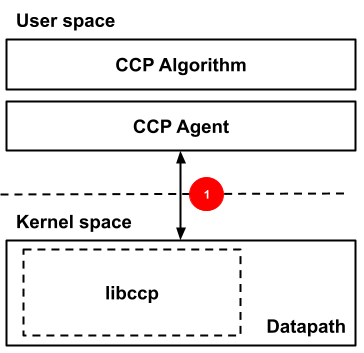
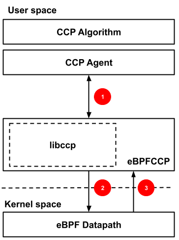
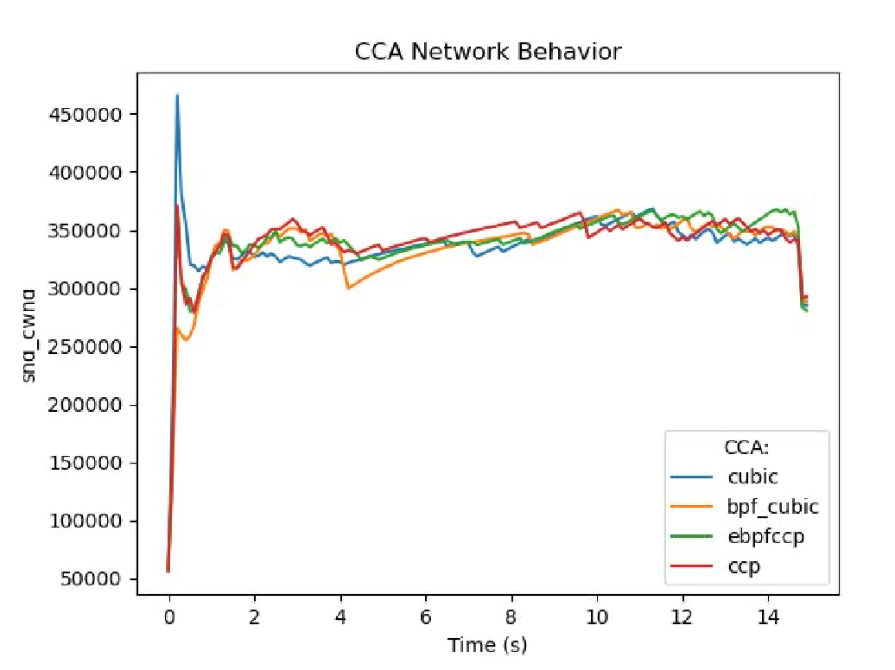
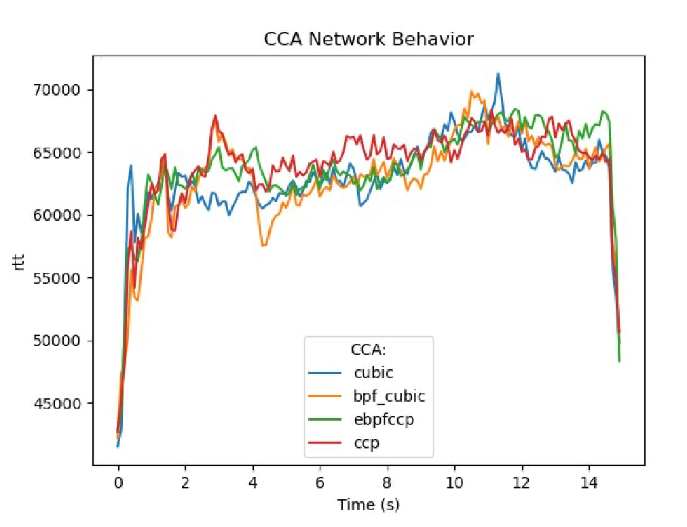
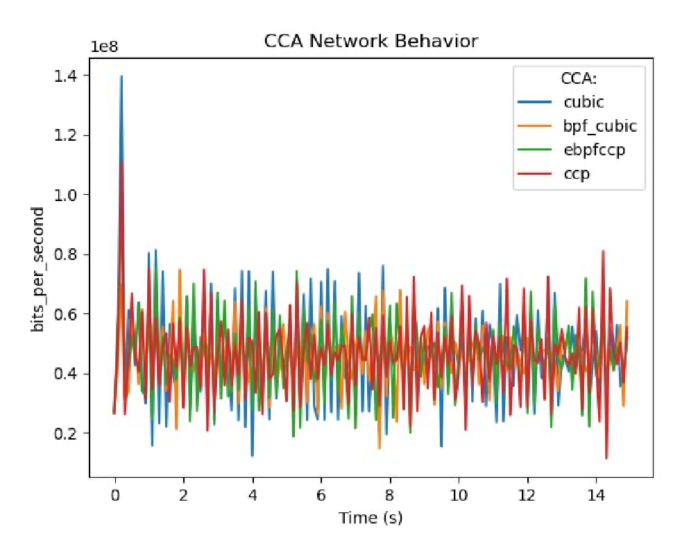
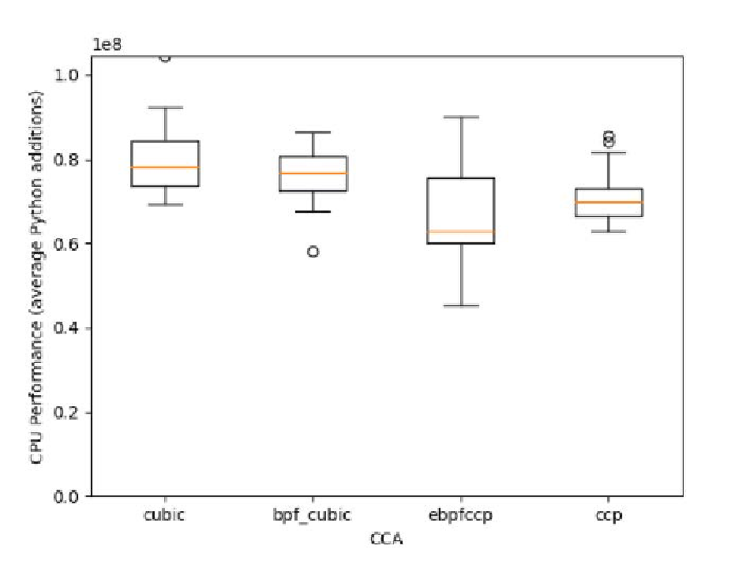

---
title:
- Evaluating eBPF as a Platform for Congestion Control Algorithm
author:
- Edward Wibowo
- Bokai Bi
---

# Outline

- **Introduction**
- eBPFCCP Design
- Evaluation
- Results & Conclusions

---

# Abstract

- **Goal**: Explore eBPF for Congestion Control Algorithms (CCAs).
- **Comparison**: Kernel-based (Linux TCP), eBPF-based, CCP, eBPFCCP.
- **Outcome**: eBPFCCP simplifies CCA deployment and development.

---

# Introduction

- **Challenges with Kernel modules**:
  - Complex kernel programming.
  - Difficult adoption due to safety concerns.
  - Hard to get right.
- **eBPF Benefits**:
  - Verifier provides safety guarantees.
  - Has hooks for TCP congestion control.

---

# Related Work

- **CCP**:
  - Congestion Control Plane.
  - Can implement CCAs independent of datapath.

---

# eBPFCCP Design

- **Key Features**:
  - User-space: `libccp` (from original CCP paper) for control logic and Rust layer for eBPF loading and management.
  - Kernel-space: eBPF for flow hooks.
  - Communication via BPF maps (BPF hash maps and BPF ring buffers).

---

# eBPFCCP Design

{ width=50% }

---

# eBPFCCP Design

{ width=40% }

---

# eBPFCCP Design

- **Goals**:
  - Match existing CCP behavior.
  - Minimize performance overhead.

---

# Evaluation: Setup

- **Metrics**:
  - Behavior: Match existing CCAs.
  - Performance: CPU overhead.
- **Method**:
  - Use `iperf3` and `mahimahi`.
  - Controlled VM (single-core).

---

# Results

{ width=60% }

---

# Results

{ width=60% }

---

# Results

{ width=60% }

---

# Results

{ width=60% }

---

# Results

- **Behavior**:
  - All implementations behave similarly.
- **Performance**:
  - eBPF close to kernel-native.
  - eBPFCCP slightly slower due to communication overhead.

---

# Limitations

- **Challenges**:
  - Unix-pipe communication impacts performance.
  - eBPF VM adds slight overhead.
- **Future Work**:
  - Optimize communication channels.
  - Integrate eBPFCCP directly with CCP.

---

# Conclusion

- **eBPF as a Platform**:
  - Viable for safe, iterative CCA development.
  - Comparable performance to kernel-native CCAs.
- **Implications**:
  - Lowers entry barriers for research.
  - Promotes broader adoption.
